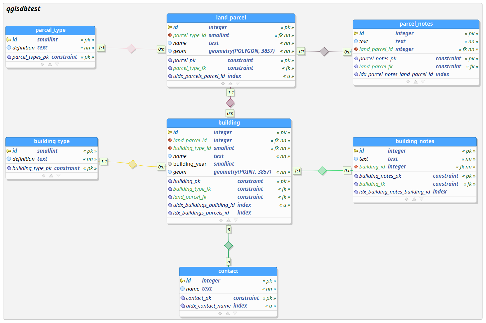
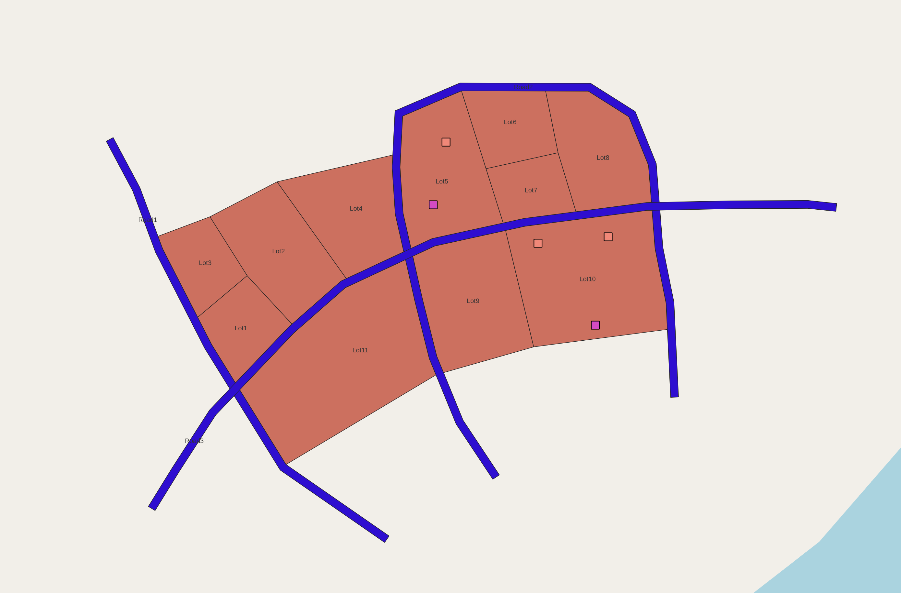
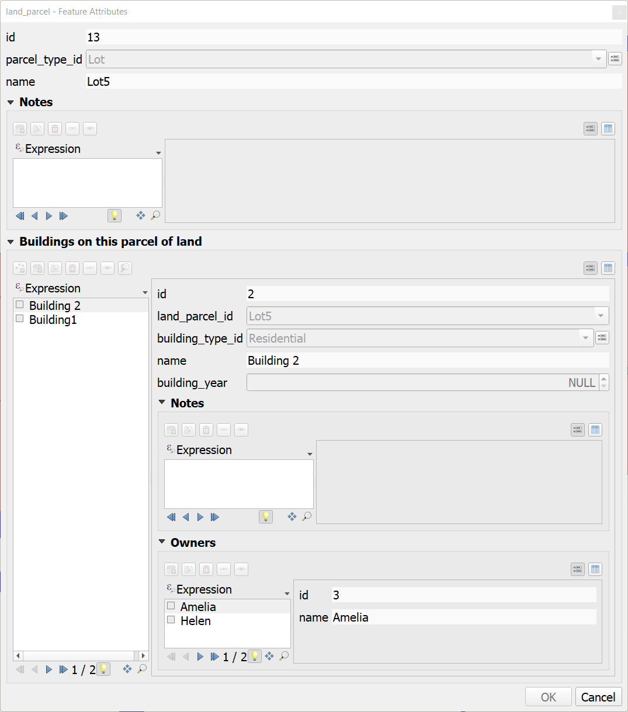

# QGIS db performance analysis

This repository provides a sample data to reproduce performance issues with QGIS when reading data from PostGIS database.

## Issue description

With a complex database data model and with complex QGIS forms containing many relationships interacting with the forms is frustratingly slow.

QGIS makes many duplicate SQL queries to the database which could cause at least some of the slowness.

## Reproduce the issue

1. Configure Postgresql as in [pg.conf](pg.conf) to log all statements.
2. Create a db named "qgisdbtest"
3. Create schema `psql -f qgisdbtest.sql`
4. Insert data `psql -f insert_data.sql`
5. Open the qgis-project and open a form of some land parcel
6. Inspect the PostgreSQL logs

It can be seen from the [logs](logs/open%20form%20lot5.log) that QGIS generates many duplicate queries. For example 
```sql
BEGIN READ ONLY;DECLARE qgis_138 BINARY CURSOR FOR SELECT "id","name"::text FROM "qgisdbtest"."land_parcel"
FETCH FORWARD 2000 FROM qgis_138
CLOSE qgis_138;COMMIT
BEGIN READ ONLY;DECLARE qgis_140 BINARY CURSOR FOR SELECT "id","name"::text FROM "qgisdbtest"."land_parcel"
FETCH FORWARD 2000 FROM qgis_140
CLOSE qgis_140;COMMIT
BEGIN READ ONLY;DECLARE qgis_142 BINARY CURSOR FOR SELECT "id","name"::text FROM "qgisdbtest"."land_parcel"
FETCH FORWARD 2000 FROM qgis_142
CLOSE qgis_142;COMMIT
```

```sql
SELECT postgis_version()
SELECT postgis_version()
SELECT postgis_version()
```


## Sample data

### Datamodel


### Overview


### QGIS Forms

