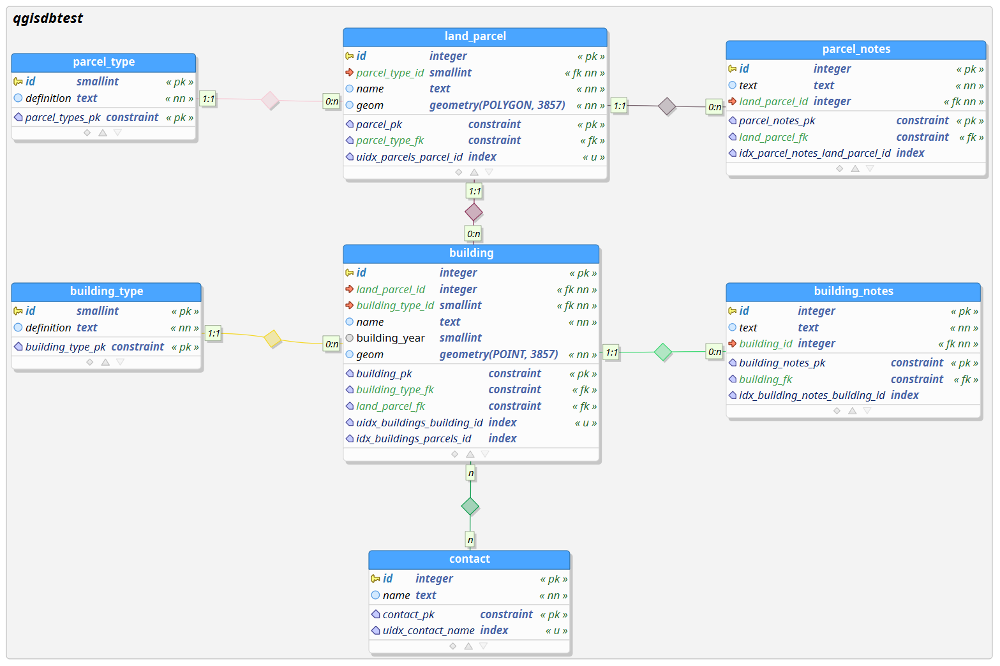
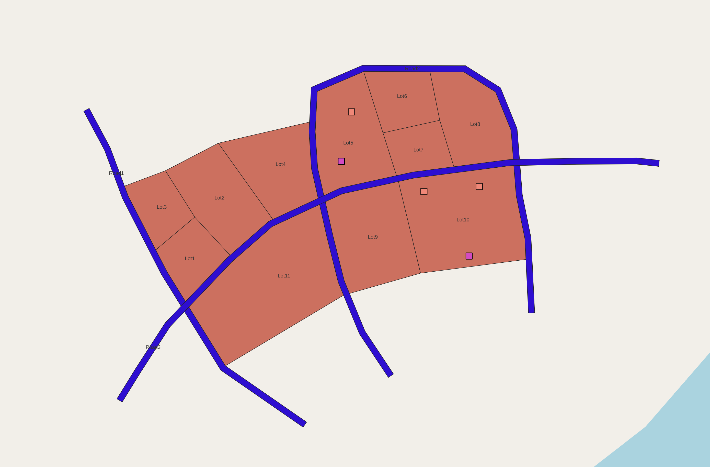
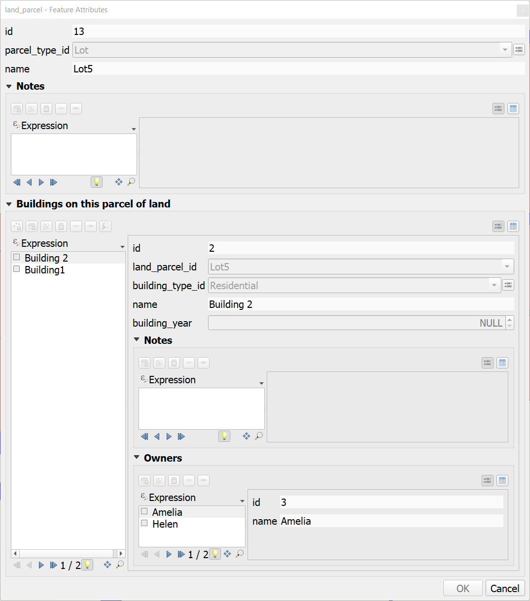

# QGIS db performance analysis

This repository provides a sample data to reproduce performance issues with QGIS when reading data from PostGIS database.

## Issue description

With a complex database data model and with complex QGIS forms containing many relationships interacting with the forms is frustratingly slow.

### Logs

In the [logs folder](logs) there are logs from PostgreSQL and QGIS Query Logger from the time frame where:
1. Project is opened
2. Lot 5 is clicked with info tool to open the feature form
3. The form is closed


It can be seen from the [PostgreSQL logs](logs/pg_logs-open_project-open_lot5_form-close-form.log) that QGIS generates many duplicate heavy load queries without where clause. For example 
```sql
-- LINE 274
BEGIN READ ONLY;DECLARE qgis_26 BINARY CURSOR FOR SELECT "id","name"::text FROM "qgisdbtest"."land_parcel"
FETCH FORWARD 2000 FROM qgis_26
CLOSE qgis_26;COMMIT

-- LINE 280
BEGIN READ ONLY;DECLARE qgis_28 BINARY CURSOR FOR SELECT "id","name"::text FROM "qgisdbtest"."land_parcel"
FETCH FORWARD 2000 FROM qgis_28
CLOSE qgis_28;COMMIT

-- LINE 286
BEGIN READ ONLY;DECLARE qgis_30 BINARY CURSOR FOR SELECT "id","name"::text FROM "qgisdbtest"."land_parcel"
FETCH FORWARD 2000 FROM qgis_30
CLOSE qgis_30;COMMIT
```

For total **QGIS generates 72 SELECT queries** to the database when opening a feature form of any land parcel in this project.

Also there can be found other duplicate queries. For example:
```sql
SELECT postgis_version()
SELECT postgis_version()
SELECT postgis_version()
```

## Sample data

### Data model


### Overview


### QGIS Forms

